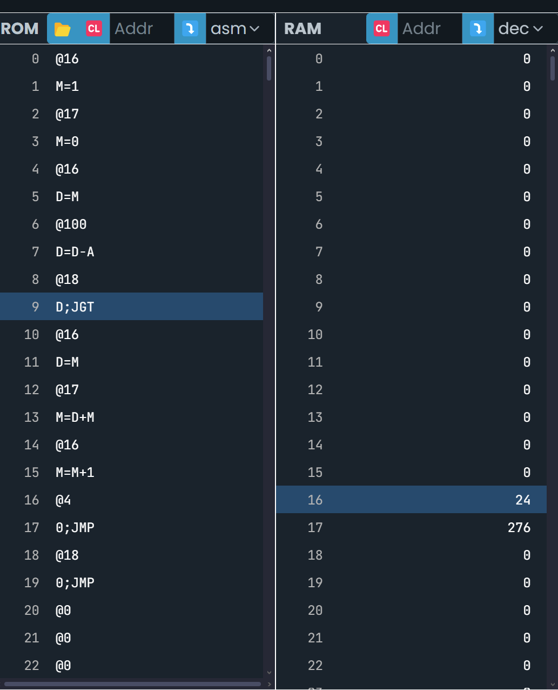

## Analiza los programas anteriores y asegúrate de entender por qué son equivalentes
Se que son equivalentes ya que al probar el codigo en emulador de C pude ver que tanto el for como el while dar por resultado lo mismo
## Convierte la versión del for a ensamblador.

## Compara las versiones en ensamblador del while y del for. ¿Qué puedes concluir?
que son realmente identicas digamos que por cuestiones de semantica o de buenas practicas la unica diferencia podria ser que en el for la variable I prodia inicializarse despues
