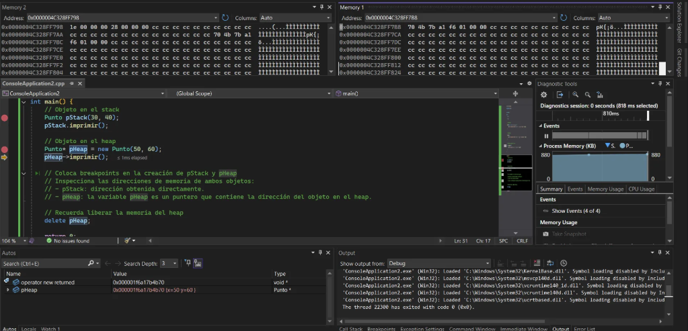

# Diferencias entre Objetos en el Stack y en el Heap en C++  

En C++, los objetos pueden almacenarse en dos regiones de memoria principales: **stack** y **heap**. Cada una tiene características distintas en cuanto a administración y rendimiento.  

---

## Análisis de Objetos en el Código  

### `pStack`  
- Es un objeto de la clase `Punto` que se **almacena en el stack**.  
- Su dirección de memoria se puede consultar con `&pStack`.  
- Se libera **automáticamente** cuando la función `main()` finaliza.  

### `pHeap`  
- Es un **puntero** que apunta a un objeto `Punto` creado dinámicamente en el **heap** mediante `new`.  
- No es el objeto en sí, sino una **referencia** a la dirección de memoria donde se encuentra el objeto.  
- Para acceder a sus miembros, se utiliza `->` en lugar de `.`.  
- Es necesario liberar su memoria manualmente con `delete pHeap;` para evitar fugas de memoria.  

---

## Observaciones en la Memoria (`Memory1`)  

### Dirección de `&pHeap` en `Memory1`  
- Representa la **ubicación en memoria** donde se almacena el puntero `pHeap` dentro del stack.  
- Su valor es la **dirección del objeto `Punto` en el heap**.  

### Contenido de `pHeap` en la pestaña "Locals"  
- Refleja los valores de `x` y `y` almacenados en la dirección de memoria a la que apunta `pHeap`.  

---

## Explicación sobre Stack y Heap  

### Stack (Pila)  
- Se usa para **objetos locales**, cuya vida útil está limitada al **ámbito donde fueron declarados**.  
- La **gestión de memoria es automática**: al finalizar la función, la memoria se libera sola.  
- Su acceso es **rápido**, lo que mejora el rendimiento del programa.  

### Heap (Montículo)  
- Se utiliza para **objetos dinámicos**, que pueden permanecer en memoria hasta que se liberen manualmente.  
- Su administración es **más lenta**, ya que la asignación y liberación de memoria requieren más tiempo.  
- Para evitar **fugas de memoria**, es obligatorio liberar los objetos con `delete`.  
